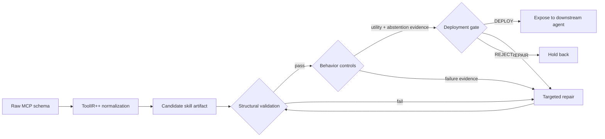

# ReliaSkill

<p align="center">
  
</p>

> **Core claim:** reliable tool use is not only a model problem. It is also a **representation problem**.

**ReliaSkill** is a pre-deployment reliability pipeline for MCP-style tool-use skills. It turns raw MCP-like schemas and sparse documentation into compact, schema-faithful, behavior-tested skill artifacts before downstream LLM agents ever see them.

Manuscript: **"ReliaSkill: From Raw MCP Schemas to Reliable Skills for Tool-Using LLM Agents"**

The paper is currently an internal draft. A public manuscript link will be added here when it is ready.

## ✨ Research Snapshot

Most tool-use failures do not begin when an agent emits malformed JSON. They begin earlier, when a tool is exposed through a representation that is **syntactically valid but operationally underspecified**. A raw MCP schema may list fields and types, yet still leave the model guessing about intent, scope, abstention, side effects, and argument construction.

ReliaSkill studies this missing layer. It treats each generated skill as a **candidate artifact**, not a trusted instruction. Before deployment, the artifact must preserve the schema, explain when the tool should and should not be used, pass structural checks, survive positive and adjacent negative controls, record repair traces, and receive an explicit gate decision.

<p align="center">
  
</p>

**Input:** raw MCP-like schemas and sparse docs.

**Output:** compact, inspected, behavior-tested skill artifacts with `DEPLOY`, `REPAIR`, or `REJECT` decisions.

**Research question:** how much reliability comes from giving the model a better-governed tool representation before it ever acts?

| Explore | What you will find |
| --- | --- |
| 🧭 [Pipeline](#-pipeline-schema--skill--gate) | Six-stage normalization, generation, validation, behavior testing, repair, and gating. |
| 🧪 [Datasets and controls](#-datasets-and-controls) | MCP-like tools, converted benchmark schemas, synthetic tools, positive controls, and adjacent negatives. |
| 📊 [Latest results](#-latest-results) | Paper ladder plus newer saved-log multi-model results. |
| 🚀 [Quick start](#-quick-start) | Minimal commands for local packaging, reliability evaluation, routing, and tests. |

## ⚡ The Short Version

Raw MCP schemas expose tool interfaces, but they rarely encode the agent-facing policy that matters in deployment:

- **When should this tool be used?**
- **When should the model abstain?**
- **How should arguments be assembled without inventing fields?**
- **How do we know a generated skill is safe enough to expose?**

ReliaSkill inserts a governed layer between protocol-level tool exposure and LLM tool invocation:

**Mental model:** `raw_mcp` → `ToolIR++` → `candidate skill` → **validate** → **test** → **repair** → **gate**

In practical terms, ReliaSkill asks: **what should happen before a new tool representation becomes visible to an agent?** The answer is not "generate a prettier prompt and hope." The answer is to treat the representation like a release candidate: inspect it, test it against real tool-use situations, try adjacent negative cases, repair localized failures, and only then decide whether it should be deployed.

| Instead of trusting... | ReliaSkill builds... |
| --- | --- |
| Thin raw schemas | Normalized ToolIR++ records with reliability metadata |
| Fluent one-shot skill text | Compact artifacts with explicit use and non-use boundaries |
| Unchecked examples | Schema-faithful examples and argument templates |
| Post-hoc debugging | Pre-deployment validation, repair, scoring, and gating |
| Utility-only evaluation | Positive controls plus adjacent negative controls |

**Output:** a deployability decision: `DEPLOY`, `REPAIR`, or `REJECT`.

ReliaSkill is intentionally focused. It is **not** a generic agent framework, an experience-rich skill-learning system, a GUI-agent skill ecosystem, or a trajectory distillation system.

## 🧭 Why Raw Schemas Are Not Enough

The MCP ecosystem makes it easy to expose tools. That is powerful, but it creates a cold-start reliability problem: a newly exposed tool can be syntactically valid while still being a poor agent-facing representation. A schema can say that a `pattern` argument exists, but not whether the model should search for files, explain a file extension, abstain because the request is underspecified, or avoid a side-effecting action.

This project begins from a simple observation in the paper: **the boundary between "tool available" and "tool appropriate" is often missing.** ReliaSkill makes that boundary explicit and auditable.

- **Schemas are interfaces, not skills.** They specify accepted arguments, but not reliable use boundaries.
- **Sparse docs leave policy implicit.** Trigger conditions, preconditions, and abstention behavior are often missing.
- **Naive generated skills can be polished but wrong.** They may invent unsupported arguments, omit required fields, or over-broaden scope.
- **Over-triggering is a reliability bug.** A tool that fires on adjacent out-of-scope requests can be worse than no tool at all.
- **Tool onboarding should happen before deployment.** Generated skills are candidates that must pass validation, behavior tests, repair, and gating.

## 🛡️ The ReliaSkill Reliability Contract

A ReliaSkill artifact should be compact enough for an agent context, but explicit enough to be inspected. The pipeline tries to enforce a small reliability contract:

- ✅ **Schema-faithful:** no invented arguments, malformed examples, or unsupported enum values.
- ✅ **Boundary-aware:** clear when-to-use and when-not-to-use guidance.
- ✅ **Behavior-tested:** positive controls measure utility; adjacent negative controls measure over-triggering risk.
- ✅ **Repairable:** failures are localized into sections that can be patched without regenerating everything.
- ✅ **Gateable:** every candidate receives explicit evidence and a `DEPLOY`, `REPAIR`, or `REJECT` decision.



## 🖼️ Visual Overview

| Why Raw Schemas Fail | ReliaSkill Pipeline |
| --- | --- |
|  |  |

| Artifact Anatomy | Selected Result Highlights |
| --- | --- |
|  |  |

## 🔁 Pipeline: Schema → Skill → Gate

Generated skills are **not trusted by default**. ReliaSkill treats each skill as an artifact that must accumulate evidence before deployment.

| Stage | Description |
| --- | --- |
| 1. ToolIR++ normalization | Preserves the raw schema while adding provenance, documentation completeness, schema complexity, ambiguity, side-effect hints, and safety metadata. |
| 2. Compact skill generation | Produces purpose, when-to-use guidance, when-not-to-use guidance, argument templates, and schema-faithful examples. |
| 3. Structural validation | Checks unsupported arguments, missing required fields, enum errors, malformed examples, contradictory guidance, missing non-use boundaries, and compactness constraints. |
| 4. Behavior-grounded evaluation | Tests positive controls and adjacent negative controls so that tool-use gains are evaluated alongside abstention behavior. |
| 5. Targeted repair | Patches localized failing sections, such as examples, argument templates, or non-use boundaries, instead of regenerating the whole skill by default. |
| 6. Deployment gating | Emits `DEPLOY`, `REPAIR`, or `REJECT` from validation evidence, behavior evidence, repair traces, and reliability scoring. |

The most important design choice is the **repair loop**. ReliaSkill does not assume one-shot skill generation is reliable. It records validation failures, behavior failures, repair traces, and scores so that artifacts can be compared, audited, and rejected when needed.

## 🧰 What This Repository Implements

| Area | Implemented support |
| --- | --- |
| **Schema ingestion** | MCP/tool schema parsing, normalization, and ToolIR++ reliability features. |
| **Skill construction** | Skill generation, prompt-template variants, compactness variants, and multi-candidate selection. |
| **Reliability checks** | Deterministic structural validation, behavior controls, targeted repair, and deploy/repair/reject gating. |
| **Evaluation** | Structured-call prediction, hidden-tool routing, hard distractor inventories, and positive/negative controls. |
| **Data conversion** | BFCL/API-style conversion and MCPToolBench++/ToolBench-style conversion when local data exists. |
| **Execution and analysis** | Sandbox live-execution subset, slice analysis, scientific comparison extraction, and low-compute scheduling. |
| **Backends** | `heuristic`, `openai_compatible`, and `local_hf` modes. |

## 👀 Who Should Care?

ReliaSkill is useful if you are studying or building:

- **Tool-using LLM agents** that need safer onboarding for new tools.
- **MCP servers or MCP-like tool collections** where raw schemas are too thin for robust agent use.
- **Function-calling evaluation** beyond simple argument matching.
- **Agent reliability research** that cares about abstention, adjacent negatives, routing, and side effects.
- **Low-compute experimentation** where smaller models need better representations rather than only larger checkpoints.

## 📁 Repository Layout

| Path | Purpose |
| --- | --- |
| `reliaskill/` | ReliaSkill-facing modules for ToolIR, validation, repair, routing, live execution, scheduling, converters, and analysis. |
| `autoskill/` | Historical compatibility package and shared implementation used by earlier experiment runners and baselines. |
| `scripts/` | Command-line entry points for data construction, generation, evaluation, routing, analysis, and table export. |
| `configs/` | JSON/YAML configs for backends, experiments, skills, controls, routing, models, repair, and data collection. |
| `data/raw/` | Curated raw tool inputs and benchmark-derived tool files. |
| `data/raw_mcp/` | Large-scale raw MCP-like tool records. |
| `data/processed_toolir/` | Normalized ToolIR records. |
| `data/controls/` | Development and held-out test controls. |
| `data/routing/` | Hidden-tool routing examples with distractor inventories. |
| `data/live_exec/` | Safe sandbox execution tasks. |
| `data/converted_external/` | Converted external benchmark records when local sources are available. |
| `data/human_skills/` | Human-skill authoring packets and submitted human skills. |
| `outputs/` | Generated packages, logs, tables, reports, plans, and experiment artifacts. |
| `docs/` | Additional runbooks and setup notes. |
| `tests/` | Unit and regression tests. |

## ⚙️ Installation

ReliaSkill is a Python project. The code uses modern typing syntax, so Python 3.10 or newer is recommended.

```powershell
python -m venv .venv
.\.venv\Scripts\Activate.ps1
python -m pip install --upgrade pip
python -m pip install -r requirements.txt
```

The base requirements are intentionally small:

- `pyyaml`
- `tqdm`
- `huggingface_hub`

For local Hugging Face inference with `local_hf`, install the optional local-model requirements:

```powershell
python -m pip install -r requirements-local.txt
```

This installs `transformers`, `torch`, `accelerate`, and `sentencepiece`. Quantized loading may require additional hardware-specific packages such as `bitsandbytes`; it is not installed by default.

## 🚀 Quick Start

The default commands use small local fixtures and the heuristic backend unless a model-backed config is supplied.

Run the packaging pipeline:

```powershell
python scripts\run_pipeline.py
```

Run the reliability pipeline:

```powershell
python scripts\run_reliability_pipeline.py --config configs\experiment.reliability.heuristic.sample.json
```

Run benchmark evaluation:

```powershell
python scripts\run_benchmark_eval.py
```

Run hidden-tool routing evaluation:

```powershell
python scripts\run_routing_eval.py
```

Run tests:

```powershell
python -m unittest discover -s tests -v
```

## 🧪 Reproducing The Main Experiments

The full experiment path is designed to regenerate evidence from saved logs rather than hand-edited tables. A complete run can be expensive; start with planning and smoke tests before launching model-backed evaluation.

1. Build or collect tool data:

```powershell
python scripts\convert_external_benchmarks.py --input data\external --output data\converted_external --sources bfcl api_bank toolbench
python scripts\collect_mcp_tools.py --config configs\data\large_scale.yaml
```

2. Build controls:

```powershell
python scripts\build_controls.py --config configs\controls\large_scale.yaml
```

3. Build routing distractors:

```powershell
python scripts\build_distractor_inventories.py --tools data\processed_toolir\tools.jsonl --controls data\controls\test.jsonl --output data\routing\test_routing.jsonl
```

4. Generate, validate, and repair skills:

```powershell
python scripts\run_generation.py --config configs\skills\multi_candidate.yaml
python scripts\run_reliability_pipeline.py --config configs\experiment.reliability.heuristic.sample.json
```

5. Plan and run benchmark evaluation:

```powershell
python scripts\plan_experiment_run.py --config configs\experiments\strong.yaml --gpu_budget_gb 12
python scripts\run_experiment.py --config configs\experiments\strong.yaml
```

6. Build tables from saved logs:

```powershell
python scripts\make_tables.py --run outputs\strong
```

7. Run slice analysis and scientific comparison extraction:

```powershell
python scripts\analyze_result_slices.py --run outputs\strong --tools data\processed_toolir\tools.jsonl --controls data\controls\test.jsonl --routing data\routing\test_routing.jsonl
python scripts\extract_scientific_comparisons.py --tables-dir outputs\tables
```

The complete command chain and runbook are in [docs/FULL_EXPERIMENT_RUN.md](docs/FULL_EXPERIMENT_RUN.md).

## 🧬 Datasets And Controls

The current local prepared state includes:

| Quantity | Value |
| --- | ---: |
| MCP-like tools | 295 |
| Sources | 10 |
| Domains | 14 |
| Side-effect tools | 63 |
| Hard tools | 261 |
| Synthetic tools | 48 |
| Total controls | 2,950 |
| Development controls | 1,475 |
| Held-out test controls | 1,475 |
| Per-tool controls | 5 positive and 5 negative |
| Hidden-tool routing examples | 5,900 |
| Average routing candidates | 8 |
| Routing examples per distractor level | 1,475 |

Controls are split into development and held-out test sets. Development controls may be used for candidate selection, repair, and threshold tuning; test controls are reserved for final reporting.

Converted benchmark schemas and synthetic tools are marked by provenance. They should be described as MCP-like or converted benchmark records, not as production MCP deployments.

## 🧩 Representation Conditions

The paper reports the main ReliaSkill ladder. The current saved-log experiments also include newer prompt-template and reviewer-baseline condition names. These names should not be collapsed unless the underlying artifact construction is identical.

| Condition | Description |
| --- | --- |
| `raw_mcp` | Raw schema and sparse documentation exposed directly. |
| `schema_only` | Deterministically cleaned schema package. |
| `docs_only` | Sparse documentation-only control. |
| `retrieved_docs` | Runtime retrieved documentation snippets. |
| `retrieved_candidates` | Candidate-tool retrieval baseline for routing. |
| `retrieved_memory` | Skill-memory retrieval baseline. |
| `naive_skill` | One-shot compact generated skill in the paper ladder. |
| `naive_skill_k1` | Single-candidate generated skill in the newer saved-log condition set. |
| `validated_skill` | Generated skill plus deterministic structural validation report. |
| `repaired_skill` | Validated skill after conservative targeted repair. |
| `gated_skill` | Paper-ladder repaired skill with reliability score and deploy/repair/reject decision. |
| `multi_candidate_repaired_gated` | Newer saved-log multi-candidate, repaired, gated condition. It is related to but not identical to the paper's `gated_skill` condition name. |
| `autoskill_base` | Legacy validation-aware generated skill package used for comparison. |
| `raw_schema_plus_examples` | Raw schema augmented with examples. |
| `generated_docs_no_validation` | Generated documentation without the full validation and behavior-test pipeline. |
| `generic_validator_no_behavior_tests` | Structural validator baseline without behavior-grounded tests. |
| `full_regeneration_repair` | Repair by regenerating the whole artifact. |
| `skill_prompt_compact_default` | Compact default prompt-template skill condition. |
| `skill_prompt_boundary_first` | Prompt-template condition that foregrounds use and non-use boundaries. |
| `skill_prompt_example_rich` | Prompt-template condition with more examples. |
| `skill_prompt_safety_aware` | Prompt-template condition emphasizing side effects and safety. |
| `skill_prompt_verbose_docs` | Verbose-docs-style prompt-template condition. |
| `skill_ultra_compact`, `skill_compact`, `skill_medium`, `skill_verbose` | Compactness-controlled skill variants. |
| `raw_docs_full`, `generated_docs_verbose` | Verbose documentation baselines. |
| `human_written_skill_upper_bound` | Human-authored skill workflow when real submitted artifacts are available. |

## 📊 Latest Results

The results should be read as a representation study, not a generic leaderboard. The question is not only "which model is strongest?" but **which representation helps a model call the right tool, assemble valid arguments, and avoid firing on adjacent negative controls?**

ReliaSkill reports two result views:

- **Paper main ladder:** the clean paper framing for the core ReliaSkill pipeline.
- **Latest saved-log multi-model results:** newer runs with additional prompt-template and baseline condition names.

These are intentionally separated below.

### Paper Result: Main ReliaSkill Ladder

The paper's main Qwen2.5-7B result set reports the following ladder:

| Condition | Joint EM | Selection Accuracy | Argument Validity |
| --- | ---: | ---: | ---: |
| `raw_mcp` | 17.15% | 26.07% | 43.66% |
| `schema_only` | 15.73% | 25.80% | 41.22% |
| `naive_skill` | 18.85% | 27.36% | 50.07% |
| `gated_skill` | 21.12% | 31.39% | 52.78% |

Ablation results from the paper:

| System | Joint EM | Argument Validity | Selection Accuracy |
| --- | ---: | ---: | ---: |
| Full ReliaSkill | 21.12% | 52.78% | 31.39% |
| w/o Repair | 20.41% | 53.05% | 27.39% |
| w/o Validation | 18.85% | 50.07% | 27.36% |
| w/o Examples | 15.73% | 41.22% | 25.80% |

Argument Validity is not strictly monotonic: w/o Repair has slightly higher Argument Validity than Full ReliaSkill, but Full ReliaSkill has higher Joint EM and Selection Accuracy.

### Latest Saved-Log Multi-Model Results

The tables below use the latest saved-log condition names and the latest pasted multi-model results. They are not identical to the paper's main ReliaSkill ladder because they include additional prompt-template and baseline conditions.

#### Structured-Call Results

| Model | Condition | Exact Match | Argument Validity |
| --- | --- | ---: | ---: |
| gemma2-2B | `raw_mcp` | 0.4380 | 0.8108 |
| gemma2-2B | `autoskill_base` | 0.4393 | 0.6963 |
| gemma2-2B | `human_written_skill_upper_bound` | 0.3037 | 0.7538 |
| gemma2-2B | `skill_prompt_boundary_first` | 0.5207 | 0.7840 |
| gemma2-2B | `skill_prompt_verbose_docs` | 0.5254 | 0.7985 |
| Qwen2.5-1.5B-Instruct | `raw_mcp` | 0.3858 | 0.7540 |
| Qwen2.5-1.5B-Instruct | `schema_only` | 0.3424 | 0.7301 |
| Qwen2.5-1.5B-Instruct | `retrieved_docs` | 0.4034 | 0.8266 |
| Qwen2.5-1.5B-Instruct | `autoskill_base` | 0.3431 | 0.6736 |
| Qwen2.5-1.5B-Instruct | `full_regeneration_repair` | 0.4380 | 0.6927 |
| Qwen2.5-1.5B-Instruct | `skill_prompt_compact_default` | 0.5851 | 0.7242 |
| Qwen2.5-1.5B-Instruct | `skill_prompt_boundary_first` | 0.6163 | 0.7531 |
| Qwen2.5-1.5B-Instruct | `skill_prompt_example_rich` | 0.5681 | 0.7384 |
| Qwen2.5-1.5B-Instruct | `skill_prompt_safety_aware` | 0.6007 | 0.7363 |
| Qwen2.5-1.5B-Instruct | `skill_prompt_verbose_docs` | 0.5614 | 0.7841 |
| Qwen2.5-7B | `raw_mcp` | 0.5302 | 0.9663 |
| Qwen2.5-7B | `schema_only` | 0.5098 | 0.9526 |
| Qwen2.5-7B | `autoskill_base` | 0.6332 | 0.9066 |
| Qwen2.5-7B | `raw_schema_plus_examples` | 0.5980 | 0.9593 |
| Qwen2.5-7B | `generated_docs_no_validation` | 0.6190 | 0.9260 |
| Qwen2.5-7B | `generic_validator_no_behavior_tests` | 0.6529 | 0.9172 |
| Qwen2.5-7B | `full_regeneration_repair` | 0.6285 | 0.9528 |
| Qwen2.5-7B | `naive_skill_k1` | 0.6244 | 0.8924 |
| Qwen2.5-7B | `multi_candidate_repaired_gated` | 0.6183 | 0.8331 |
| phi 3.5-mini | `raw_mcp` | 0.3397 | 0.9697 |
| phi 3.5-mini | `autoskill_base` | 0.4244 | 0.9602 |
| phi 3.5-mini | `human_written_skill_upper_bound` | 0.3261 | 0.9649 |
| phi 3.5-mini | `skill_prompt_boundary_first` | 0.6373 | 0.9693 |
| phi 3.5-mini | `skill_prompt_verbose_docs` | 0.6217 | 0.9681 |
| llama3.2 1B | `raw_mcp` | 0.3342 | 0.8685 |
| llama3.2 1B | `autoskill_base` | 0.3776 | 0.9224 |
| llama3.2 1B | `human_written_skill_upper_bound` | 0.3871 | 0.9288 |
| llama3.2 1B | `skill_prompt_boundary_first` | 0.5281 | 0.9322 |
| llama3.2 1B | `skill_prompt_verbose_docs` | 0.5220 | 0.9307 |

#### Hidden-Tool Routing Results

| Model | Condition | Tool Accuracy | Joint Exact |
| --- | --- | ---: | ---: |
| gemma2-2B | `raw_mcp` | 0.5214 | 0.2102 |
| gemma2-2B | `autoskill_base` | 0.6278 | 0.2698 |
| gemma2-2B | `human_written_skill_upper_bound` | 0.5241 | 0.1519 |
| gemma2-2B | `skill_prompt_boundary_first` | 0.5647 | 0.3180 |
| gemma2-2B | `skill_prompt_verbose_docs` | 0.6373 | 0.3403 |
| Qwen2.5-1.5B-Instruct | `raw_mcp` | 0.5214 | 0.1444 |
| Qwen2.5-1.5B-Instruct | `schema_only` | 0.5159 | 0.1376 |
| Qwen2.5-1.5B-Instruct | `retrieved_docs` | 0.5498 | 0.1980 |
| Qwen2.5-1.5B-Instruct | `retrieved_candidates` | 0.6359 | 0.2176 |
| Qwen2.5-1.5B-Instruct | `autoskill_base` | 0.6278 | 0.1702 |
| Qwen2.5-1.5B-Instruct | `generated_docs_verbose` | 0.6576 | 0.2725 |
| Qwen2.5-1.5B-Instruct | `raw_docs_full` | 0.5769 | 0.2149 |
| Qwen2.5-1.5B-Instruct | `skill_prompt_compact_default` | 0.5424 | 0.2637 |
| Qwen2.5-1.5B-Instruct | `skill_prompt_boundary_first` | 0.5647 | 0.3153 |
| Qwen2.5-1.5B-Instruct | `skill_prompt_safety_aware` | 0.5580 | 0.3010 |
| Qwen2.5-1.5B-Instruct | `skill_prompt_verbose_docs` | 0.6373 | 0.3302 |
| Qwen2.5-7B | `raw_mcp` | 0.5214 | 0.3431 |
| Qwen2.5-7B | `schema_only` | 0.5159 | 0.3146 |
| Qwen2.5-7B | `autoskill_base` | 0.6278 | 0.4224 |
| Qwen2.5-7B | `raw_schema_plus_examples` | 0.5186 | 0.3756 |
| Qwen2.5-7B | `generated_docs_no_validation` | 0.5458 | 0.3912 |
| Qwen2.5-7B | `generic_validator_no_behavior_tests` | 0.5478 | 0.4081 |
| Qwen2.5-7B | `full_regeneration_repair` | 0.5451 | 0.4088 |
| Qwen2.5-7B | `naive_skill_k1` | 0.5471 | 0.3769 |
| Qwen2.5-7B | `multi_candidate_repaired_gated` | 0.5485 | 0.3580 |
| phi 3.5-mini | `raw_mcp` | 0.5214 | 0.2522 |
| phi 3.5-mini | `autoskill_base` | 0.6278 | 0.3132 |
| phi 3.5-mini | `human_written_skill_upper_bound` | 0.5241 | 0.2373 |
| phi 3.5-mini | `skill_prompt_boundary_first` | 0.5647 | 0.4529 |
| phi 3.5-mini | `skill_prompt_verbose_docs` | 0.6373 | 0.4271 |
| llama3.2 1B | `raw_mcp` | 0.5214 | 0.2224 |
| llama3.2 1B | `autoskill_base` | 0.6278 | 0.2624 |
| llama3.2 1B | `human_written_skill_upper_bound` | 0.5241 | 0.2400 |
| llama3.2 1B | `skill_prompt_boundary_first` | 0.5647 | 0.3776 |
| llama3.2 1B | `skill_prompt_verbose_docs` | 0.6373 | 0.3519 |

Structured-call Exact Match evaluates whether the produced call matches the gold call. Argument Validity checks whether produced arguments are parseable and schema-faithful. Hidden-tool routing Tool Accuracy checks whether the model selects the right tool from candidates. Hidden-tool routing Joint Exact requires both routing and argument correctness. The latest saved-log tables are not identical to the paper's main ReliaSkill ladder because they include additional prompt-template and baseline conditions.

## 🔎 Key Takeaways From Current Results

- Across several smaller models, `skill_prompt_boundary_first` and `skill_prompt_verbose_docs` often improve structured-call Exact Match over `raw_mcp`.
- In hidden-tool routing, verbose-doc or boundary-first representations often improve Joint Exact over `raw_mcp`.
- On Qwen2.5-7B, `generic_validator_no_behavior_tests` has the highest structured-call Exact Match among the listed saved-log conditions.
- On Qwen2.5-7B routing, `autoskill_base` has the highest hidden-tool routing Joint Exact among the listed routing conditions.
- The latest saved-log table does **not** support a claim that `multi_candidate_repaired_gated` dominates all baselines. The paper's main ReliaSkill ladder should be reported separately from the newer saved-log multi-model table.

## ⚠️ Reliability And Safety Notes

- Negative-control precision in the paper result should be interpreted as no observed harmful activation on the held-out negative controls, not as a production safety guarantee.
- Structural validation checks skill artifacts. Argument Validity measures model-generated calls.
- Production deployment still needs least-privilege permissions, sandboxing, audit logs, rate limits, monitoring, and human approval for high-impact actions.
- Converted benchmark schemas and synthetic tools should not be overstated as real production MCP deployments.

## 🧱 Limitations

- ReliaSkill focuses on MCP skill cold-start, not experience-rich skill evolution.
- The corpus combines MCP-like tools, converted benchmark schemas, and explicitly marked synthetic tools.
- Results do not guarantee generalization to all production MCP servers, proprietary models, or live external APIs.
- Current evaluation emphasizes structured-call prediction and adjacent negative-control abstention; live execution and end-to-end task completion need further work.
- The reliability score is rule-based and auditable, not a learned calibrated probability of correctness.

## 📚 Additional Documentation

- [Full experiment runbook](docs/FULL_EXPERIMENT_RUN.md)
- [Local model setup](docs/LOCAL_MODELS.md)
- [Dataset and model notes](docs/DATASETS_AND_MODELS.md)
- [MCP cold-start reliability architecture](docs/MCP_COLD_START_RELIABILITY.md)
- [Low-compute experiments](docs/LOW_COMPUTE_EXPERIMENTS.md)
- [Larger MCP negative-control benchmark](docs/LARGER_MCP_NEGATIVE_CONTROL_BENCHMARK.md)
- [Related-work baselines](docs/RELATED_WORK_BASELINES.md)

## 📝 Citation

```bibtex
@misc{zeng2026reliaskill,
  title={ReliaSkill: From Raw MCP Schemas to Reliable Skills for Tool-Using LLM Agents},
  author={Zeng, Zian and Yuan, Mu},
  year={2026},
  note={Manuscript}
}
```

## License

See [LICENSE](LICENSE).
